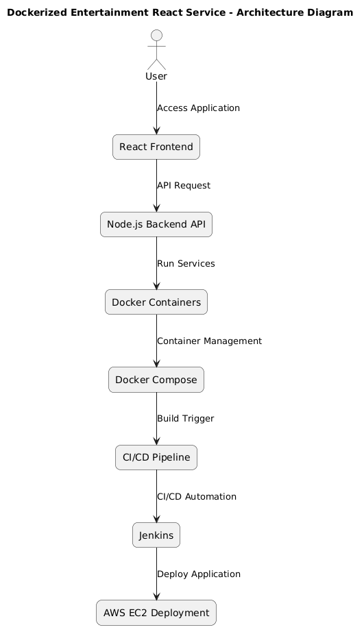

# Dockerized Entertainment React Service

A **containerized full-stack entertainment web application** built using **React (frontend)** and **Node.js + Express (backend)**, deployed using **Docker, Docker Compose, Jenkins CI/CD, and AWS EC2**.

This project demonstrates how modern applications can be **developed, containerized, automated, and deployed using DevOps practices**.

---

# Project Overview

The **Dockerized Entertainment React Service** is a web application that displays entertainment content such as movies along with their ratings.

The project focuses on implementing **DevOps principles**, including:

- Containerization using Docker
- Multi-container orchestration using Docker Compose
- Automated CI/CD pipeline using Jenkins
- Cloud deployment using AWS EC2

The goal of the project is to demonstrate **real-world DevOps workflow from development to deployment**.

---

# System Architecture

## Architecture Flow

   

---

### Architecture Workflow

This architecture ensures that the application can be **built, tested, containerized, and deployed automatically**.

--- 

# Tech Stack

## Frontend
- React.js
- Vite
- CSS

## Backend
- Node.js
- Express.js

## DevOps Tools
- Docker
- Docker Compose
- Jenkins
- GitHub

## Cloud Platform
- AWS EC2

## Future DevOps Tools
- Kubernetes
- Prometheus
- Grafana

---

# Features

- Responsive React based user interface
  
- Backend API using Node.js and Express
  
- Docker containerization
  
- Multi-container setup using Docker Compose
  
- Automated CI/CD pipeline using Jenkins
  
- Deployment on AWS EC2 cloud
  
- DevOps based project architecture
  
- Scalable design for Kubernetes integration

---

# Repository Structure
```bash
Devops_entertainment_project
│
├── frontend
│ ├── src
│ ├── public
│ └── package.json
│
├── backend
│ ├── controllers
│ ├── routes
│ ├── server.js
│ ├── package.json
│ └── Dockerfile
│
├── docker-compose.yml
├── Jenkinsfile
├── archi_dev.png
├── Devops_HLDfile.pdf
├── Devops_LLDfile.pdf
└── README.md
```
---

# Installation and Setup

## Clone the Repository

```bash
git clone https://github.com/PushprajSingh16/Devops_entertainment_project.git
cd Devops_entertainment_project
```


## Run Project Locally

Run Backend
```bash
cd backend
npm install
node server.js
```

Run Frontend
```bash
cd frontend
npm install
npm run dev
```

Application will run at:
```bash
http://localhost:5173
```

## Docker Setup

Build Docker Image
```bash
docker build -t entertainment-app .
```

Run Docker Container
```bash
docker run -p 3000:3000 entertainment-app
```

## Docker Compose
Docker Compose is used to manage multiple containers for frontend and backend services.

Run application using:

```bash
docker-compose up --build
```
Stop containers:
```bash
docker-compose down
```

## CI/CD Pipeline

The project integrates Jenkins CI/CD pipeline for automation.

- Pipeline Workflow

- Developer pushes code to GitHub repository

- Jenkins detects new commit

- Jenkins triggers pipeline

- Docker image is built

- Image is deployed to AWS EC2

- Application becomes accessible online

This pipeline ensures automated build and deployment process.

## AWS Deployment

The application is deployed on AWS EC2 instance using Docker containers.

Deployment Steps:

- Launch EC2 instance

- Install Docker

- Clone GitHub repository

- Build Docker image

- Run container using Docker Compose

Access the application using:
```bash
http://<EC2_PUBLIC_IP>:3000
```

## DevOps Workflow
```bash
Developer
↓
GitHub Repository
↓
Jenkins CI/CD Pipeline
↓
Docker Build
↓
Docker Container
↓
AWS EC2 Deployment
↓
User Access
```
This workflow ensures continuous integration and continuous deployment.

# Screenshots

/screenshots/app_ui.png

# Project design documents included in repository:

- HLD (High Level Design) – System architecture and workflow
- LLD (Low Level Design) – Detailed system components

# Future Improvements

### Future enhancements for this project include:

- Kubernetes container orchestration
- Load balancing
- Monitoring using Prometheus and Grafana
- Infrastructure automation using Terraform
- Authentication and user management
- Database integration

